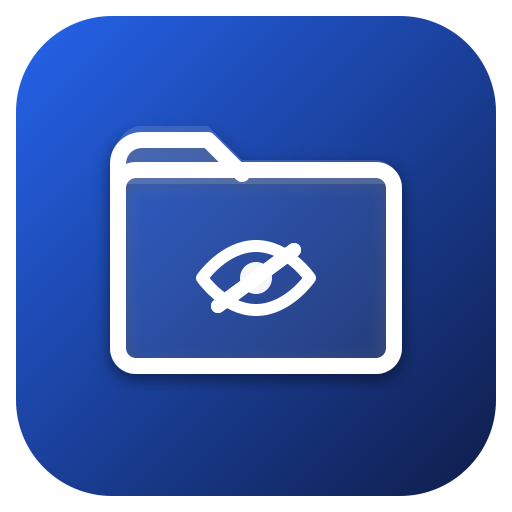

  

<h1 align="center">Undrive</h1>

  <strong>Your Drive, unseen.</strong> 
  Hidden file storage inside your own Google Drive.

  <a href="https://undrive-app.vercel.app">Live App</a> · <a href="#features">Features</a> · <a href="#how-it-works">How It Works</a> · <a href="#privacy">Privacy</a> · <a href="#faq">FAQ</a>

---

## What is Undrive?

Undrive gives you a **private, invisible vault** inside your existing Google Drive. Files stored through Undrive are placed in a special hidden area — they don't show up anywhere in Google Drive's UI, search, mobile apps, or desktop sync.

Only Undrive can see them. Your storage. Your files. Completely hidden.

---

## Features

**Store & Organize**
- Upload files via drag-and-drop or file picker with real-time progress
- Organize with virtual folders — nest, move, copy, and rename
- Grid and list views with search, sort, and bulk actions

**Access Anywhere**
- Preview images and PDFs directly in the browser
- Download individual files or export your entire vault as a ZIP
- Responsive design — works seamlessly on desktop, tablet, and mobile

**Stay in Control**
- See your Google Drive storage usage at a glance
- Trash with 7-day auto-delete and one-click restore
- PIN lock for an extra layer of on-device protection
- Light, dark, and system theme support

**Zero Trust Architecture**
- Files transfer directly between your browser and Google — nothing passes through any server
- Only `drive.appdata` scope is requested — Undrive cannot see or touch your regular Drive files
- No accounts, no databases, no analytics on your files

---

## How It Works

1. **Sign in with Google** — Authorize Undrive with minimal permissions (hidden app folder only).
2. **Upload your files** — They're stored in Google Drive's invisible folder.
3. **Access anytime** — Browse, preview, download, and manage your hidden files through Undrive.

All files use your existing Google Drive storage quota (15 GB free, or whatever plan you have).

---

## Privacy

| Concern | Answer |
|---|---|
| **Does Undrive store my files?** | No. Files go directly from your browser to Google Drive. |
| **Can Undrive see my regular Drive files?** | No. We only request the `drive.appdata` scope. |
| **Is there a backend server?** | Only for authentication. File operations happen entirely client-side. |
| **Can Google see my files?** | Google stores the raw data. End-to-end encryption is planned for Phase 2. |

---

## FAQ

**Does this count toward my storage?**
Yes. Files in this invisible folder use your normal Google Drive quota.

**Can I see these files in Google Drive?**
No. The hidden folder is completely invisible from Drive's web UI, mobile apps, and desktop sync.

**What happens if I uninstall Undrive?**
Your files remain in the hidden folder. Reconnect Undrive anytime to access them again. You can also revoke access from [Google Account settings](https://myaccount.google.com/permissions), which deletes the hidden data.

**Is my data safe?**
Your files are as safe as anything in Google Drive. Undrive never stores, logs, or processes your files.

---

## Roadmap

| Phase | Status | Description |
|---|---|---|
| **Phase 1** | Live | Web app with hidden Drive storage, folders, preview, PIN lock |
| **Phase 2** | Planned | End-to-end encryption (AES-256-GCM, vault password, zero-knowledge) |
| **Phase 3** | Planned | Chrome extension with context menu, popup, and Drive page integration |

---

## Built With

[Next.js](https://nextjs.org/) · [Tailwind CSS](https://tailwindcss.com/) · [shadcn/ui](https://ui.shadcn.com/) · [Google Drive API](https://developers.google.com/drive) · [Zustand](https://zustand.docs.pmnd.rs/) · [Lucide](https://lucide.dev/)

---

  Made with care. Your files, your drive, your privacy.

